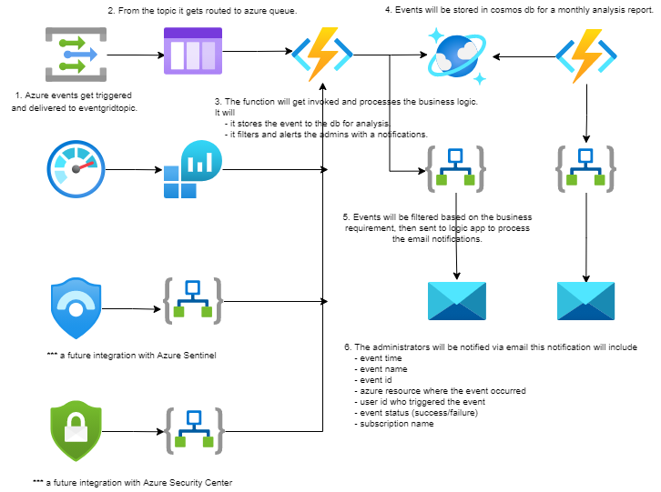
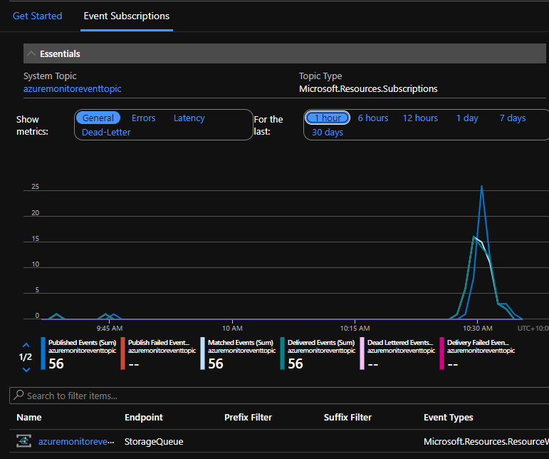
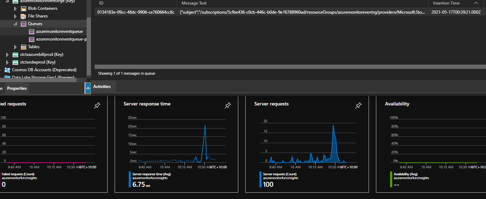
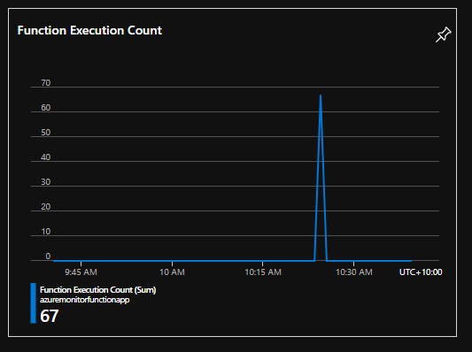
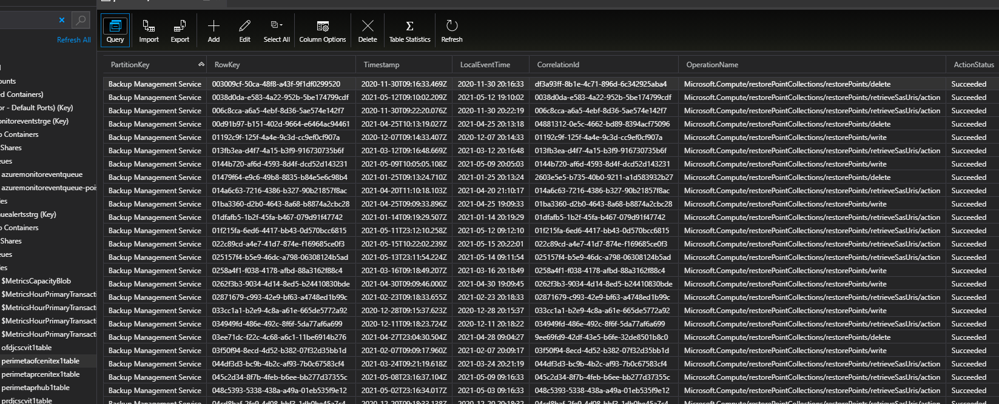
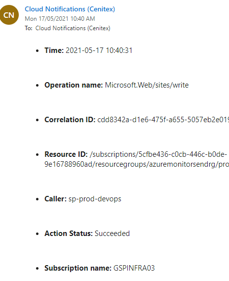
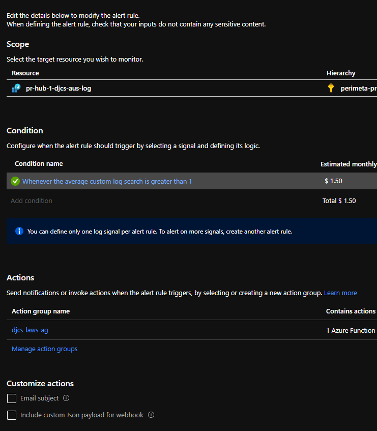
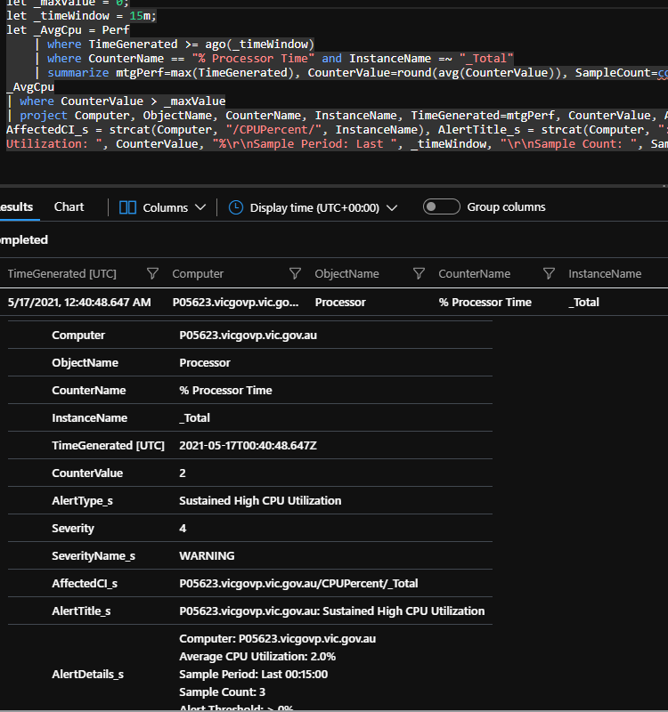

# VICGOV - Azure Alert, Monitor, Report Workflow
## 1. Introduction
### 1.1	Overview

As a result of needing to improve on cloud monitoring solution, Hosting Platform Services has been working to resolve number of issues and centralizing source of azure monitor via a workflow described in the diagram 2.1. 
 
This document is intended to provide a high level overview of workflow how the events captures and sends out the notifications. 
 
Included in this report is a step by step detailed guide around where to look for troubleshooting.

## 2 Logical Architecture
### 2.1	Logical System Component Overview

1. Azure events get triggered and delivered to eventgridtopic.
    - 

2. From the topic it gets routed to azure queue.

    - 

3. The function will get invoked and processes the business logic.
It will
    - it stores the event to the db for analysis.
    - it filters and alerts the admins with a notifications.
    - 

4. Events will be stored in cosmos db for a monthly analysis report.
    - 

5. Events will be filtered based on the business requirement, then sent to logic app to process the email notifications. 
    - 

6. The administrators will be notified via email this notification will include 
    - event time 
    - event name 
    - event id 
    - azure resource where the event occurred 
    - user id who triggered the event 
    - event status (success/failure) 
    - subscription name
    - 

7. Azure monitor will run kql queries for checking log analytics workspace for VM metrics. 
    - 

8. If the thrashold gets exceeded it will invoke the function for process.
    - 

9. Function will be triggered for processing.